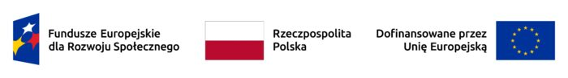

# Szkolenie z języka programowania R

## Wymagania

+ R w wersji przynajmniej 4.4.2 (+ Rtools dla Windows)
+ RStudio / Positron / Google Colab
+ Pakiety: `tidyverse`, `data.table`, `sandwich`
+ Dane:
  + plik `gospodarstwa.xlsx`, `gospodarstwa.csv`, `gospodarstwa2.csv`
  + inne pliki: [Badanie Kapitału Ludzkiego](https://www.parp.gov.pl/component/site/site/bilans-kapitalu-ludzkiego#metodologiabadaniabkl)
  
## Podstawowe informacje

**Zakres szkolenia**:

-   Omówienie czym jest język R oraz sposobów pracy (`RStudio`,
    `Positron`, `Google Colab`)
-   Wprowadzenie do konsoli R (konsola, `Rstudio`)
-   Podstawowe operacje w języku R (R jako kalkulator)
-   Struktury danych i wczytywanie z plików w różnych formatach
-   Eksploracyjna analiza danych (tablice, wykresy)
-   Wprowadzenie do statystyki i ekonometrii w R (statystyki opisowe,
    regresja, odporne błędy standardowe)
-   Rozszerzanie możliwości w R z wykorzystaniem dodatkowych pakietów
    (m.in. `ggplot2`, `data.table`, `tidyverse`, specjalistyczne pakiety
    do statystyki i ekonometrii)
-   Tworzenie raportów i odtwarzalność wyników badań (m.in.
    `R Notebook`, `Quarto`, `renv`)

**Harmonogram**

+ Poniedziałek 7.08: 8:00-16:00 (8 x 45 min)
+ Wtorek 8.07: 8:00-16:00 (8 x 45 min)
+ Piątek 11.07: 8:00-16:00 (8 x 45 min)

## Ćwiczenia

+ Rozgrzewka:
    + Wczytaj zbiór danych `data/wizy-2018.csv`.
    + Podsumuj zbiór danych.
    + Stwórz wykres rozrzutu między zmienną `issued_visas`, a `denied_visas`. Czy jest jakaś zależnosć? 
    + Stwórz nową zmienną `success = denied_visas/no_visas` i wyznacz podstawowe statystyki opisowe.

## Finansowanie

Projekt „Kompleksowy program podniesienia kwalifikacji i kompetencji
kadry akademickiej i doktorantów Uniwersytetu Ekonomicznego w Poznaniu”
FERS.01.05-IP.08-0182/23 współfinansowany przez Unię Europejską z
Europejskiego Funduszu Społecznego Plus w ramach Programu Fundusze
Europejskie dla Rozwoju Społecznego 2021-2027 [LINK](https://ue.poznan.pl/pozyskiwanie-funduszy/kompleksowy-program-podniesienia-kwalifikacji-i-kompetencji-kadry-akademickiej-i-doktorantow-uniwersytetu-ekonomicznego-w-poznaniu/)

## Literatura
